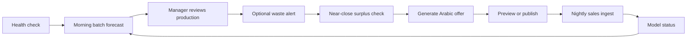
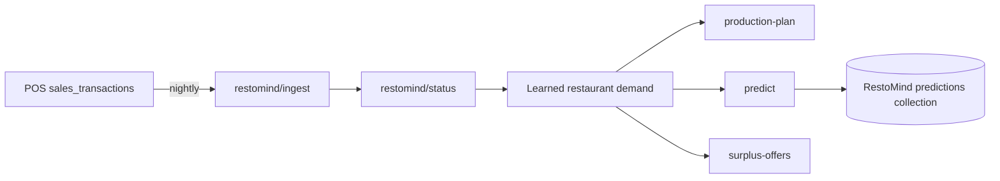

# API endpoint flow

This service exposes 17 application endpoints. The ready-to-run examples and response
checks are in [`postman_collection.json`](postman_collection.json). FastAPI also generates
interactive schemas at `/docs` and `/openapi.json` while the service is running.

## Before calling the API

- Default base URL: `http://127.0.0.1:8000`.
- Send `Content-Type: application/json` with every `POST` request.
- Every application endpoint except `GET /health` uses the `X-API-Key` header when API-key
  protection is configured. In Postman, set the collection variable `apiKey`; the collection
  adds the header automatically.
- The frontend should call the RestoMind backend, and the backend should call this service.
  Do not expose the AI service or its key in browser code.
- The native bakery endpoints use fixed `sku` values. The `/integration/restomind/*`
  endpoints use RestoMind's `restaurantId` and `productId`. They are two API contracts over
  the same forecasting logic; normally an integration chooses one contract rather than
  mixing both.

## Main bakery flow



1. Call `GET /health` before sending work. Continue when `status` is `ok`.
2. Each morning call `POST /forecast/daily-batch` for the full production plan. Use the
   single-item and weekly routes for drill-down screens or planning.
3. When a manager overrides a quantity, call `POST /alerts/waste-prevention`. An alert is
   raised only when the plan is above the forecast's upper bound.
4. Near closing, call `POST /surplus/detect` with current stock. For each returned item,
   pass its `sku` and `suggested_discount_pct` to `POST /marketing/generate-offer`.
5. Pass the generated `copy_ar` to `POST /marketing/publish`. Keep `dry_run: true` for a
   safe preview. `dry_run: false` can create a real public post when Meta publishing is
   enabled and credentials are present.
6. At the end of every business day, call `POST /data/ingest` with actual sales,
   production, and closing stock. Check `GET /model/status` to show learning progress.

## RestoMind backend flow



1. Call `POST /integration/restomind/ingest` nightly with `sales_transactions`. Include
   `productionQty` and `closingStock` when available so sold-out days are not mistaken for
   low-demand days. Product metadata may be supplied in the same call.
2. Call `GET /integration/restomind/status/{restaurant_id}` to show observed days and
   whether each product uses `owner_estimate` or `learned_from_sales`.
3. Call `POST /integration/restomind/production-plan` for the admin's daily production
   screen. It returns one recommendation per supplied product.
4. Call `POST /integration/restomind/predict` for a product's seven-day prediction, then
   store the response in RestoMind's `predictions` collection.
5. Near closing, call `POST /integration/restomind/surplus-offers`. It combines surplus
   detection, a suggested discount, and Egyptian-Arabic offer copy. It does not publish
   the offer to social media.

The RestoMind production-plan, predict, and surplus-offers routes also register or refresh
the product metadata they receive. When enough usable sales history exists, these routes
use the learned per-restaurant level; until then they fall back to `avgDailySales`.

Only step 1 makes those routes date-sensitive. A learned level is an *ordinary-day* figure
by construction (its quiet-day sample excludes weekends and events), and the calendar that
puts it back on a specific date is fitted during ingest. A product still on `avgDailySales`
has no history to fit one from, so it returns the same quantity for every date — check
`calendarMultiplier` in the plan, or `calendarAware` in the status response, rather than
inferring it from the numbers.

## Endpoint reference

| Method and path | What it does | Main result or side effect |
|---|---|---|
| `GET /health` | Checks service readiness | Status, training time, known SKU count; no authentication required |
| `GET /model/status` | Reports native model mode per SKU | Observed days, switch progress, rule-based or trained mode |
| `POST /data/ingest` | Adds native end-of-day actuals | Updates history and may retrain/promote an SKU |
| `POST /forecast/daily` | Forecasts one SKU for one date | Quantity, interval, confidence, source, and factors |
| `POST /forecast/weekly` | Forecasts one SKU for seven days | Daily forecasts and weekly total |
| `POST /forecast/daily-batch` | Forecasts all or selected SKUs for one date | Complete daily production plan in one call |
| `POST /forecast/weekly-batch` | Forecasts all or selected SKUs for seven days | One weekly plan per SKU |
| `POST /forecast/seasonality-adjustment` | Isolates calendar impact | Baseline, adjusted quantity, multiplier, and calendar context |
| `POST /alerts/waste-prevention` | Checks a manager's manual production quantity | Severity, excess quantity, waste cost, and explanation |
| `POST /surplus/detect` | Finds stock likely to remain at closing | At-risk items, urgency, discount, and value at risk |
| `POST /marketing/generate-offer` | Creates Egyptian-Arabic promotional copy | Price calculation, copy, hashtags, and generator used |
| `POST /marketing/publish` | Renders or publishes an offer | Safe preview by default; real external side effect only when explicitly enabled |
| `POST /integration/restomind/ingest` | Adds sales history for one RestoMind restaurant | Persists history, product metadata, day counts, and learned levels |
| `GET /integration/restomind/status/{restaurant_id}` | Reports learning state for a restaurant | Product tracking, thresholds, observed days, and level source |
| `POST /integration/restomind/production-plan` | Builds a daily RestoMind production plan | Per-product quantities and persisted product metadata |
| `POST /integration/restomind/surplus-offers` | Finds surplus and creates offers in one call | At-risk products, discount, Arabic copy, and refreshed metadata |
| `POST /integration/restomind/predict` | Builds a prediction document for one product/week | Weekly total, daily breakdown, features, confidence, and factors |

## Request-to-response detail

### Native bakery endpoints

#### `GET /health`

- **Request:** no body and no API key required.
- **Processing:** checks whether the in-memory forecast service has finished startup training.
- **Response:** `status` (`ok` or `training`), `model_trained_at`, `known_skus`, and
  `data_source`. It does not change any data.

#### `GET /model/status`

- **Request:** no body.
- **Processing:** reads the forecast service's history for every known SKU and calculates
  its mode, observed days, days remaining to the training threshold, and progress.
- **Response:** `train_threshold_days`, total rule-based/trained counts, and an `items`
  array. Use this response to draw an admin progress bar; it does not forecast or retrain.

#### `POST /data/ingest`

- **Request:** `{ "records": [{ "date", "sku", "sales_qty", "production_qty", "closing_stock" }] }`.
- **Processing:** converts the records to the model's history format, derives leftover
  quantity and stockout flags, stores the actuals, updates the cold-start baseline, and
  retrains/promotes an SKU when it reaches the configured history threshold.
- **Response:** `rows_ingested`, `model_retrained`, `newly_switched_to_ml`, and
  `total_days_by_item`. This is a state-changing request and should be sent once per
  completed business day, not repeatedly for the same data.

#### `POST /forecast/daily`

- **Request:** `{ "sku": "SWEET_KONAFA", "date": "YYYY-MM-DD" }`.
- **Processing:** validates the SKU, routes the SKU to its trained or rule-based model,
  applies Egyptian-calendar effects, and calculates the recommended production quantile
  plus its interval.
- **Response:** one forecast containing `recommended_quantity`, `lower_bound`,
  `upper_bound`, `confidence`, `source`, and explanatory `factors`. It is read-only.

#### `POST /forecast/weekly`

- **Request:** `{ "sku": "SWEET_KONAFA", "start_date": "YYYY-MM-DD" }`.
- **Processing:** runs the daily forecast logic for seven consecutive dates beginning at
  `start_date`.
- **Response:** `sku`, `start_date`, `total_quantity`, and seven `days`, each with the
  same fields as the daily forecast. It is read-only.

#### `POST /forecast/daily-batch`

- **Request:** `{ "date": "YYYY-MM-DD", "skus": ["OPTIONAL", "SKU", "LIST"] }`;
  omit `skus` to forecast the entire native catalogue.
- **Processing:** validates the optional SKU list and runs one all-item forecast pass for
  the requested date.
- **Response:** `date`, `item_count`, `total_quantity`, and `items` containing a daily
  forecast per SKU. This is the recommended morning POS/backend call.

#### `POST /forecast/weekly-batch`

- **Request:** `{ "start_date": "YYYY-MM-DD", "skus": ["OPTIONAL", "SKU", "LIST"] }`.
- **Processing:** forecasts seven dates for every selected SKU, or every SKU when the list
  is omitted.
- **Response:** `start_date`, `item_count`, and `items`; each item is a complete weekly
  response. It is read-only.

#### `POST /forecast/seasonality-adjustment`

- **Request:** `{ "sku": "SWEET_KONAFA", "date": "YYYY-MM-DD" }`.
- **Processing:** calculates the normal-day baseline and the calendar-adjusted quantity
  separately, including Ramadan, Eid, holidays, weekend, and school-term context.
- **Response:** `baseline_quantity`, `adjusted_quantity`, `multiplier`, `factors`, and
  `calendar`. Use it to explain a forecast; it does not save anything.

#### `POST /alerts/waste-prevention`

- **Request:** `{ "sku": "PASTRY_CROISSANT", "date": "YYYY-MM-DD", "planned_quantity": 100 }`.
- **Processing:** gets the forecast for the given day, compares the manager's plan with
  the forecast upper bound, and estimates avoidable waste using the item's economics.
- **Response:** `severity`, `excess_qty`, `projected_waste_cost_egp`, forecast values,
  message, and factors. A `none` severity means the planned quantity is within tolerance.

#### `POST /surplus/detect`

- **Request:** `{ "stock": { "SKU": 25 }, "timestamp": "optional ISO timestamp", "close_hour": 22 }`.
- **Processing:** normalizes the check time to Cairo time, forecasts each supplied SKU for
  that date, estimates its remaining sales before closing, and keeps only items at risk of
  remaining unsold.
- **Response:** `checked_at`, `items_at_risk`, and `total_value_at_risk_egp`. Each risk
  item includes `projected_surplus`, urgency, a suggested discount, and hours to close.

#### `POST /marketing/generate-offer`

- **Request:** `{ "sku": "CAKE_GATEAU", "discount_pct": 25, "close_time": "10 بالليل" }`.
- **Processing:** looks up the product's price and Arabic name, validates the discount,
  then creates copy through the configured LLM or the safe template fallback.
- **Response:** old/new price, `copy_ar`, `valid_until`, `hashtags`, and `generator`
  (`llm` or `template`). It generates text only; it does not publish it.

#### `POST /marketing/publish`

- **Request:** `{ "sku", "copy_ar", "platforms": ["facebook"], "dry_run": true }`.
- **Processing:** validates target platforms. With `dry_run: true` it renders previews;
  with `dry_run: false` it attempts to call Meta only when live publishing is enabled and
  the required credentials are configured.
- **Response:** `status` (`preview`, `published`, or `failed`), `preview`, `post_ids`, and
  `message`. A live publish is an external, public side effect.

### RestoMind bridge endpoints

#### `POST /integration/restomind/ingest`

- **Request:** `{ "restaurantId", "records": [{ "date", "productId", "salesQty", "productionQty?", "closingStock?" }], "products?": [] }`.
- **Processing:** converts RestoMind sales rows to a per-restaurant history, registers any
  supplied products, saves the restaurant state, re-learns ordinary-day product levels, and
  refits each learned product's calendar effects (weekday shape, and Ramadan/holiday shape
  once the history has actually contained one) from that restaurant's own sales. Both are
  recomputed from the whole history on every call, so this is the only endpoint that makes
  a plan calendar-aware.
  Stockout days are excluded from the learned average when `closingStock` is zero.
- **Response:** `restaurantId`, `rowsIngested`, `productsTracked`, `daysByProduct`, and
  `learnedLevels`. This is the RestoMind equivalent of the nightly native ingest.

#### `GET /integration/restomind/status/{restaurant_id}`

- **Request:** the `restaurant_id` path parameter; no body.
- **Processing:** reads the restaurant registry and evaluates every tracked product's
  observed-day count and level source.
- **Response:** product counts, `usingLearnedLevel`, the service-owned learning thresholds,
  and `items` containing `productId`, title, `observedDays`, `levelSource`,
  `learnedLevel`, and `calendarAware`. It does not change state, and it returns no
  predictions — `learnedLevel` is the product's ordinary-day level, which is the input to
  a forecast rather than one. `calendarAware: false` means every date will get that same
  flat level from the forecasting endpoints.

#### `POST /integration/restomind/production-plan`

- **Request:** `{ "restaurantId", "date", "products": [{ "productId", "title", "category?", "price?", "unitCost?", "freshnessWindow?", "avgDailySales?" }] }`.
- **Processing:** converts product fields to the bridge model, persists product metadata,
  reads each product's learned level when available, applies the restaurant's own learned
  calendar for `date`, and produces a profit-aware daily recommendation. A product carrying
  a trained catalogue `sku` bypasses all of that and is forecast by the trained model.
- **Response:** `restaurantId`, `date`, `totalRecommendedQty`, and `items` with
  `recommendedQty`, bounds, confidence, source, `levelSource`, `baseDailyLevel`,
  `calendarMultiplier`, and factors. It may update stored product metadata.
- **Reading the quantity:** `recommendedQty ≈ baseDailyLevel × calendarMultiplier`, adjusted
  within the ±10% band by the newsvendor service level when `unitCost` and `price` are both
  known. `calendarMultiplier: 1.0` means the product has no learned calendar yet — it is on
  the owner's `avgDailySales`, or its history is below the learning threshold — and every
  date will therefore return the same quantity.

#### `POST /integration/restomind/surplus-offers`

- **Request:** `{ "restaurantId", "stock": [{ "productId", "title", "currentStock", "category?", "price?", "unitCost?", "freshnessWindow?", "avgDailySales?" }], "timestamp?", "closeHour" }`.
- **Processing:** normalizes time to Cairo, persists the received product metadata, uses
  learned demand levels when available, detects each product's near-close risk, chooses a
  discount, and generates Arabic offer copy for risky items.
- **Response:** `restaurantId`, `checkedAt`, and `itemsAtRisk`. Each item has
  `projectedSurplus`, risk score, urgency, suggested discount, optional `offerCopyAr`, and
  `newPrice`. It does not publish social posts.

#### `POST /integration/restomind/predict`

- **Request:** `{ "restaurantId", "productId", "title", "targetWeek", "category?", "avgDailySales?", "avgDailySalesWindow?", "promotionActive" }`.
- **Processing:** registers/refreshes the product, selects learned demand or the owner
  estimate, applies calendar and promotion effects to each day of the target week, and
  builds a prediction-document-shaped result.
- **Response:** `restaurantId`, `productId`, `modelVersionId`, `targetWeek`,
  `predictedOrders`, `confidence`, `featuresUsed`, `factors`, and a seven-entry
  `dailyBreakdown`. The caller should persist this response in RestoMind's `predictions`
  collection.

## `production-plan` vs `predict`

| Question | `POST /integration/restomind/production-plan` | `POST /integration/restomind/predict` |
|---|---|---|
| Business decision | “What should this restaurant make on this date?” | “What demand should we save for this product in this week?” |
| Scope | Many products, one day | One product, seven days |
| Main caller | Admin/production screen, normally each morning | Backend job that writes the `predictions` collection, normally weekly |
| Required identity | `restaurantId` + `products[]` | `restaurantId` + `productId` + `title` |
| Time input | `date` | `targetWeek` |
| Key output | `recommendedQty`, lower/upper bounds, production factors for every product | `predictedOrders`, seven-day breakdown, model version, and feature snapshot |
| Economics used | `price`, `unitCost`, and `freshnessWindow` can move the recommendation toward less waste or fewer stockouts | Not currently used by this route; it forecasts demand, not a profit-optimal production quantity |
| Storage effect | Refreshes the AI registry's product metadata | Refreshes metadata and returns a prediction-shaped document; the RestoMind backend stores it in `predictions` |

### Why each input is needed

`restaurantId` is not the demand input. It identifies the tenant and lets the service find
sales history already learned for that restaurant. The actual prediction still needs a
target and facts about the product:

| Input | Why the model needs it |
|---|---|
| `date` / `targetWeek` | Egyptian calendar effects depend on the exact date: Ramadan, Eid, holidays, weekend, and school term. Without a date there is nothing to forecast. |
| `productId` | Selects the individual learned sales level and makes the response safe to store against the correct product. `predict` cannot choose a product from only a restaurant ID. |
| `products[]` | `production-plan` is a menu-wide daily plan, so it needs to know which products are currently active. A restaurant ID alone cannot determine whether a product is discontinued, hidden, or newly added. |
| `title` | Returns human-readable production and prediction results, and supports product metadata in the AI registry. |
| `category` | Maps the product to demand priors. For example, sweet products and pastries react differently during Ramadan. |
| `avgDailySales` | Cold-start fallback demand level before the restaurant has enough usable sales history. Once a learned level exists, that level takes priority. |
| `avgDailySalesWindow` | Tells the service when an average was measured, so an average that already includes Ramadan is not multiplied by Ramadan a second time. |
| `price`, `unitCost`, `freshnessWindow` | Used by `production-plan` to choose a profit-aware production quantity: short-lived/expensive-to-waste products are kept nearer the lower interval, while high-margin products can be produced nearer the upper interval. |
| `promotionActive` | Marks a weekly prediction as being made while a promotion is active; it is recorded in `featuresUsed` for auditability. |

### Why the request contains product data instead of only `restaurantId`

The current AI service is separate from the RestoMind backend. It owns only its AI registry
(learned levels and metadata supplied by calls to `/integration/restomind/ingest`,
`/production-plan`, `/surplus-offers`, or `/predict`). It does **not** query RestoMind's
`products`, `restaurants`, or `sales_transactions` collections when these endpoints run.

That separation is intentional:

- The RestoMind backend remains the source of truth for menu, pricing, and sales data.
- The AI service needs no credentials or direct read access to the main application database.
- The backend can send a small, explicit projection of only active products and the fields
  needed for this calculation, rather than sharing the whole database schema.
- The contract works the same when the AI service is deployed separately or when the
  backend database changes implementation.

The recommended implementation is therefore: **the frontend sends only the restaurant and
date to the RestoMind backend; the backend queries its database; then the backend sends the
small product payload to the AI service.** For example:

```text
Admin UI -> RestoMind API: restaurantId + date
RestoMind API -> MongoDB: active products for that restaurant
RestoMind API -> AI service: restaurantId + date + projected product fields
AI service -> RestoMind API: production plan
RestoMind API -> Admin UI: production plan
```

This gives the frontend the simple `restaurantId` request you want without coupling the AI
service directly to the operational database.

It is possible to make the AI service accept only `restaurantId`, but that is a different
endpoint design and still needs at least a date for `production-plan`, and a product plus a
target week for `predict`. It would require the AI service to be given database access,
define which products are active, and own error handling and authorization for those
queries. It should be added as a new explicit database-backed endpoint, not assumed by the
existing endpoints.

## Common responses and safeguards

| Status | Meaning | Caller action |
|---|---|---|
| `200` | Request completed | Consume the JSON response |
| `401` | API key is missing or invalid | Send the correct `X-API-Key`; do not retry with the same key |
| `404` | A requested resource or SKU was not found | Correct the identifier |
| `422` | JSON shape, date, quantity, SKU, or platform is invalid | Fix the request using the validation details |
| `429` | Rate limit reached | Wait for the `Retry-After` header before retrying |
| `503` | Forecast service is still starting | Check `/health`, then retry with backoff |

Use ISO dates (`YYYY-MM-DD`). For timestamps, include an explicit offset such as
`2025-03-15T19:30:00+02:00`; business-time calculations are normalized to Cairo time.

## Running the Postman collection

1. Import `postman_collection.json` into Postman.
2. Set `baseUrl`, and set `apiKey` when the server requires authentication.
3. Keep the example `restaurantId` and `productId`, or replace both with IDs from your
   environment.
4. Run the collection in order. The ingest requests intentionally change learning state;
   the publish example stays in dry-run mode and does not create a real social post.
